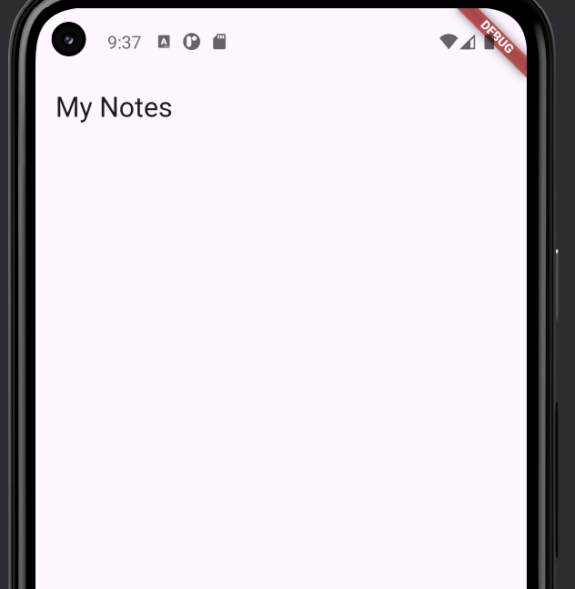
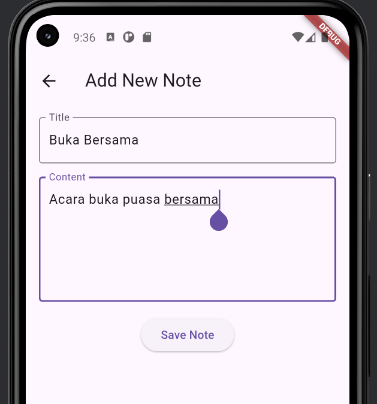
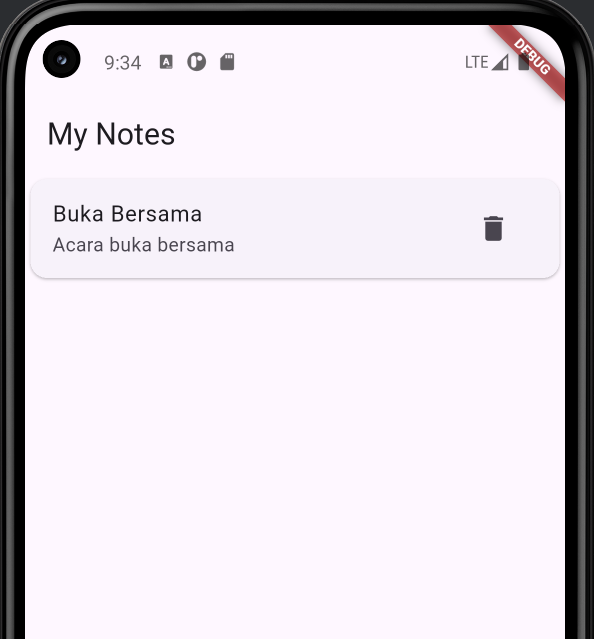

<h1 align="center">📝 App Notepad 📝</h1>

<h4 align="center">App Notepad Sederhana Dibuat Menggunakan Flutter</h4>

<h3>👥 Nama:</h3>

- Satriya Bumi Harja: **XI/PPLG-3/24**

<h3>App ini menggunakan Provider untuk manajemen state</h3>

```dart
import 'package:flutter/material.dart';
import '../models/note_model.dart';

class NoteProvider with ChangeNotifier {
  final List<Note> _notes = [];

  List<Note> get notes => _notes;

  void addNote(Note newNote) {
    _notes.add(newNote);
    notifyListeners();
  }

  void deleteNote(int id) {
    _notes.removeWhere((note) => note.id == id);
    notifyListeners();
  }

  void updateNote(Note updatedNote) {
    final index = _notes.indexWhere((note) => note.id == updatedNote.id);
    if (index != -1) {
      _notes[index] = updatedNote;
      notifyListeners();
    }
  }
}
```

<h3>📷 ScreenShot</h3>

<h5>Home Page</h5>


<h5>Input Page</h5>


<h5>Notepad Page</h5>

